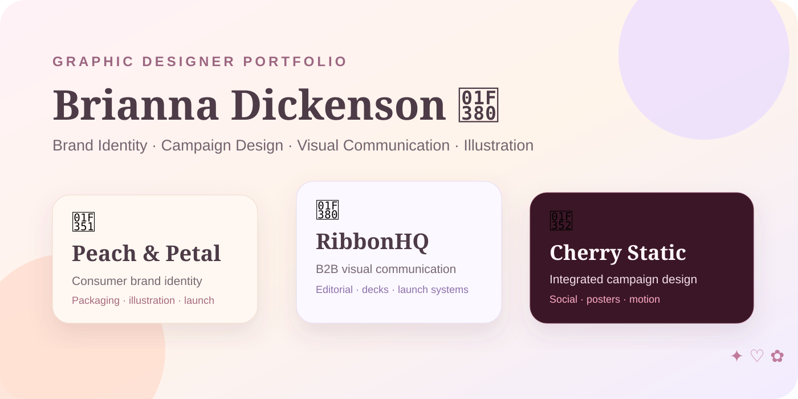
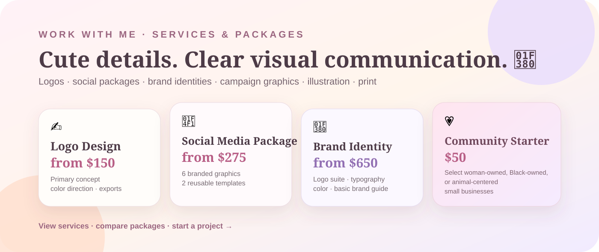
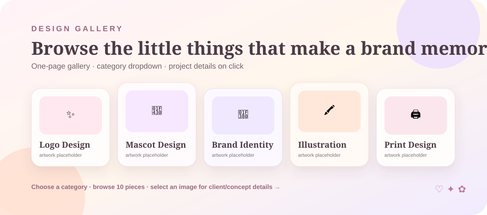

# 🎀 Brianna Dickenson 🎀

## **Graphic Designer | Brand Identity · Campaign Design · Visual Communication**

I create expressive, cohesive visual systems across **brand identity, campaigns, social, illustration, print, presentations, packaging, and motion**—balancing distinctive art direction with practical production needs.

---

## 💌 Work With Me

💻 **Seeking Full Time Remote Position**  

💌 **Available For Freelance** 

🎨 **[View Live Portfolio](https://breyhanaariel.github.io/graphic-designer/)**

I take on focused short-term graphic design work including logos and redesigns, brand identities, mascots, illustration, social media packages, campaign creative, presentations, print, packaging, and basic motion design.

🌷 **[View Services, Packages & Project Inquiry →](https://breyhanaariel.github.io/graphic-designer/services.html)**  
💌 **[Send a Project Inquiry →](https://breyhanaariel.github.io/graphic-designer/services.html#inquiry)**  
Prefer email? [breyhanadickenson@gmail.com](mailto:breyhanadickenson@gmail.com?subject=Graphic%20Design%20Project%20Inquiry)

---

## 🧠 Core Stack

**Brand & Identity:** Logo design · logo redesign · identity systems · art direction · color systems · typography · brand guidelines  
**Campaign & Marketing:** Campaign concepts · social media · paid media · launch creative · email graphics · OOH · marketing collateral  
**Mascot & Illustration:** Branded characters · mascot design · sticker artwork · custom illustration · merchandise graphics  
**Editorial & Print:** Posters · flyers · brochures · one-sheets · reports · packaging graphics · editorial layouts · prepress-minded production  
**Presentations & Digital:** Presentation design · infographics · reusable templates · web/landing-page graphics · responsive campaign assets  
**Motion:** Animated typography · logo motion · social ads · short campaign pieces  
**Tools:** Adobe Photoshop · Adobe Illustrator · Adobe InDesign · Adobe After Effects · Figma · Canva

---

## 🌷 Featured Work

*The showcase work is made up of independent concept projects. Final portfolio artwork and motion are being replaced with my own manually created work as each project is completed.*

<table>
<tr>
<td width="280" valign="top">  <a href="./peach-and-petal/README.md">📖 Case Study</a></td>
<td valign="top">
<h3>🍑 Peach &amp; Petal — Consumer Brand Identity + Packaging</h3>

Consumer Branding | Identity, packaging, illustration, campaign design, motion

A tactile botanical body-care concept exploring how a distinctive consumer identity can scale from logo and packaging through social launch assets, retail touchpoints, and motion.

<strong>Demonstrates:</strong> identity systems · packaging · illustration · patterns · retail graphics · social launch creative · logo motion

<strong>Design:</strong> Adobe Illustrator · Adobe Photoshop · Adobe InDesign · Adobe After Effects

<strong>Creative goal:</strong> Build a recognizable consumer brand system that feels expressive enough to stand out while remaining flexible across physical packaging, digital marketing, and retail applications.

<em>Independent concept project — no real client relationship or business results are claimed.</em>

</td>
</tr>
</table>

<table>
<tr>
<td width="280" valign="top">  <a href="./ribbonhq/README.md">📖 Case Study</a></td>
<td valign="top">
<h3>🎀 RibbonHQ — B2B Visual Communications System</h3>

B2B Marketing | Editorial, presentations, campaign systems, templates, motion

A collaborative-workspace concept focused on the practical visual communication needs of an in-house design team: product launches, presentations, reports, social graphics, reusable templates, and sales materials.

<strong>Demonstrates:</strong> corporate brand extension · product-launch creative · decks · reports · infographics · reusable templates · LinkedIn/email/event graphics

<strong>Design:</strong> Adobe InDesign · Adobe Illustrator · Adobe Photoshop · Figma · Adobe After Effects

<strong>Creative goal:</strong> Turn complex product and business information into a clear, consistent visual system that can support marketing, sales, editorial, and internal communication.

<em>Independent concept project — no real client relationship or business results are claimed.</em>

</td>
</tr>
</table>

<table>
<tr>
<td width="280" valign="top">  <a href="./cherry-static/README.md">📖 Case Study</a></td>
<td valign="top">
<h3>🍒 Cherry Static — Integrated Campaign + Social Motion</h3>

Campaign Design | Advertising, social, art direction, print, motion

A fictional independent music and arts festival designed as a high-energy campaign system spanning posters, outdoor, social, paid media, merchandise, event collateral, and kinetic typography.

<strong>Demonstrates:</strong> campaign concept · key visual · experimental typography · social format adaptation · poster/OOH · merchandise · animated typography

<strong>Design:</strong> Adobe Photoshop · Adobe Illustrator · Adobe InDesign · Adobe After Effects · Figma

<strong>Creative goal:</strong> Build one expressive campaign idea that remains recognizable while adapting across radically different print, environmental, social, and motion formats.

<em>Independent concept project — no real client relationship or business results are claimed.</em>

</td>
</tr>
</table>

---

## 🎨 Design Gallery

The case studies show larger visual systems. The **Design Gallery** gives clients a faster way to browse focused standalone work for individual freelance needs.

✨ **Logo Design** · 🐰 **Mascot Design** · 🎀 **Brand Identity** · 🖍️ **Illustration** · 🖨️ **Print Design**

The gallery uses one category dropdown and a simple image grid. Select any piece to view its client or clearly labeled concept-client context, description, tools, deliverables, and service inquiry option.

🌷 **[Browse the Design Gallery →](https://breyhanaariel.github.io/graphic-designer/#gallery)**

---

## ✨ Design & Production Quality

| Project | Visual-System Evidence | Production / Format Evidence | Motion / Digital Evidence |
| --- | --- | --- | --- |
| [Peach & Petal](./peach-and-petal/README.md) | Identity · typography · color · illustration · packaging language | Packaging layouts · print-minded assets · reusable identity exports | Social launch assets · logo motion direction |
| [RibbonHQ](./ribbonhq/README.md) | B2B brand extension · editorial hierarchy · information design | Presentation layouts · reports · sales collateral · reusable templates | Launch graphics · LinkedIn/email assets · product motion direction |
| [Cherry Static](./cherry-static/README.md) | Campaign art direction · key visual · typography · image treatment | Poster · OOH · event collateral · merchandise adaptations | 1:1 · 4:5 · 9:16 social formats · kinetic typography |

Portfolio work is planned around practical handoff: organized source files, scalable vector assets where appropriate, high-resolution raster exports, editable templates, print-aware layouts, multi-format campaign adaptation, and optimized motion exports.

---

## 🌈 How I Work

1. **Understand** — define the audience, objective, constraints, deliverables, channels, and success criteria.
2. **Concept** — explore multiple visual directions before committing to a system.
3. **Art Direct** — establish typography, color, imagery, composition, and overall visual language.
4. **Design** — build the approved direction into clear, polished deliverables.
5. **Extend** — test the system across print, digital, social, presentation, packaging, and motion formats as needed.
6. **QA & Deliver** — review hierarchy, consistency, accessibility where relevant, production requirements, source files, and final exports.

---

## 🌸 Explore My Work

My portfolio is intentionally separated by specialty so each discipline can tell a focused story while still showing how my design and development skills connect.

- 🎀 [UI/UX Designer](https://github.com/breyhanaariel/ui-ux-designer) — product design, research, flows, design systems, prototyping, and developer handoff
- 💻 [Front-End Developer](https://github.com/breyhanaariel/front-end-developer) — React, Next.js, TypeScript, APIs, state management, testing, accessibility, and measured performance
- 🌐 [Web Designer](https://github.com/breyhanaariel/web-designer) — responsive websites, redesigns, e-commerce, SEO/accessibility fundamentals, and business-focused client work
- 🎨 **Graphic Designer** — brand identity, campaigns, visual communication, illustration, print, presentations, and motion
