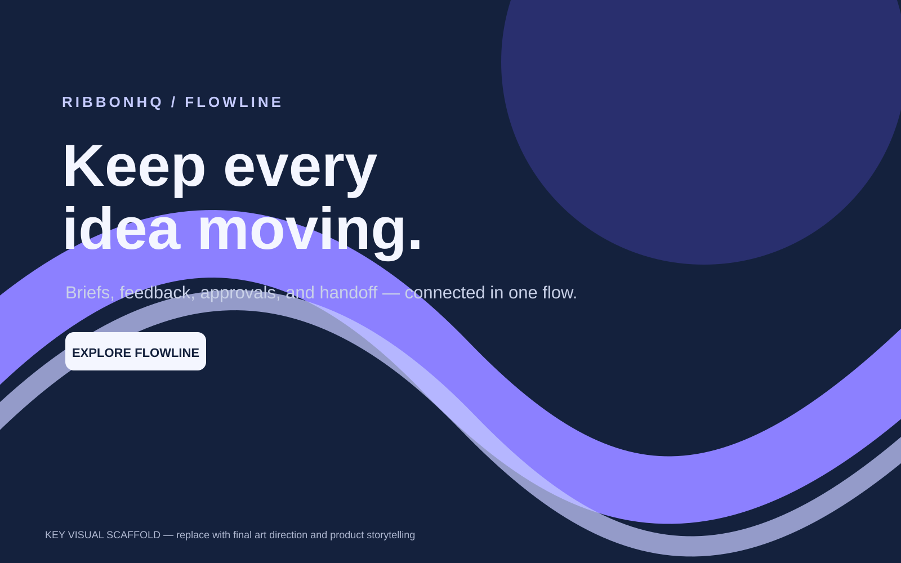
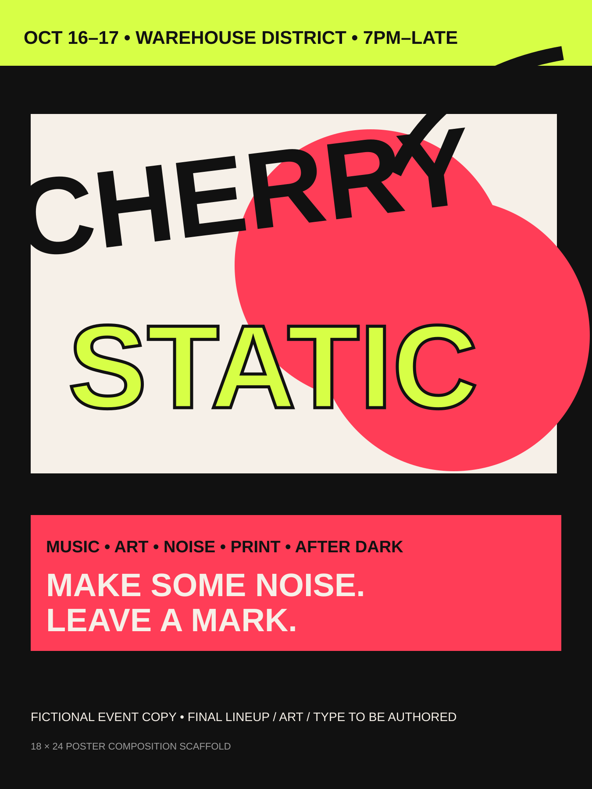

# 🎀 Brianna Dickenson 🎀

### **Graphic Designer · Brand Identity · Marketing Design · Visual Systems**

I create expressive, cohesive visual systems across **brand identity, packaging, campaigns, social, print, presentations, and digital marketing**—balancing personality with practical production needs.

💌 **Available For Freelance**  
💻 **Seeking Full-Time Remote Position**

[](https://www.linkedin.com/in/brianna-dickenson-9555515b)
[](mailto:breyhanadickenson@gmail.com?subject=Interested%20in%20a%20Graphic%20Design%20Project)

---

## 💌 Freelance Services

Available for focused short-term creative projects including:

- Logo design and redesign
- Mascot and character design
- Brand identity and visual identity systems
- Custom illustration and sticker artwork
- Print design and marketing collateral
- Campaign and launch creative
- Social media and paid advertising assets
- Presentations, reports, one-sheets, and marketing collateral
- Packaging, posters, and event materials
- Animated typography, logo motion, and short-form campaign motion

---

## 🌷 Featured Work

> **Portfolio build note:** The current SVGs and motion samples are **concept scaffolding created to establish the case-study system**. I will replace the artwork, final identities, photography, mockups, and motion with my own manually created portfolio work as each project is completed.

### 🍑 Peach & Petal — Consumer Brand Identity + Packaging
**Brand Identity · Packaging · Print · Consumer Marketing · Motion**

A tactile botanical body-care concept built to demonstrate how a distinctive consumer identity can scale from logo and packaging through social launch assets, retail touchpoints, and motion.


**What it will demonstrate**
- Identity system and art direction
- Packaging and print-production thinking
- Illustration, patterns, and custom graphic assets
- Product/social campaign design
- E-commerce and retail graphics
- Logo motion and launch animation
- Brand guidelines and production-ready exports

🔗 [View Case Study](./peach-and-petal/README.md)  
🎨 [Starter Source Assets](./peach-and-petal/source/) · 🎬 [Motion Scaffold](./peach-and-petal/motion/)

---

### 🎀 RibbonHQ — B2B Visual Communications System
**Corporate Design · B2B Marketing · Editorial · Presentations · Motion**

A collaborative-workspace concept focused on the practical visual communication needs of an in-house design team: campaign systems, decks, reports, social graphics, reusable templates, and launch materials.



**What it will demonstrate**
- Corporate brand extension
- Product-launch campaign system
- Presentation and sales collateral
- Editorial/report layout
- Infographics and reusable templates
- LinkedIn/email/event creative
- Motion graphics for product communication

🔗 [View Case Study](./ribbonhq/README.md)  
🎨 [Starter Source Assets](./ribbonhq/source/) · 🎬 [Motion Scaffold](./ribbonhq/motion/)

---

### 🍒 Cherry Static — Integrated Campaign + Social Motion
**Campaign Design · Advertising · Social · Art Direction · Motion**

A fictional independent music and arts festival designed as a high-energy campaign system spanning posters, outdoor, social, paid media, merchandise, and kinetic typography.



**What it will demonstrate**
- Campaign concept and key visual
- Experimental typography and image-making
- Paid/social format adaptation
- Poster, OOH, and event collateral
- Merchandise graphics
- Animated typography and short-form motion
- Cohesive art direction across many channels

🔗 [View Case Study](./cherry-static/README.md)  
🎨 [Starter Source Assets](./cherry-static/source/) · 🎬 [Motion Scaffold](./cherry-static/motion/)

---

## 🎨 Design Gallery

The **Design Gallery** gives clients a fast way to browse focused, standalone work alongside the larger case studies. It is intentionally simple: choose a category from one dropdown, browse the image grid, and select any piece to view its client or concept-client information, description, tools, deliverables, and service inquiry option.

**Gallery categories**  
✨ Logo Design · 🐰 Mascot Design · 🎀 Brand Identity · 🖍️ Illustration · 🖨️ Print Design

The gallery begins with **10 pieces per category** and is built to expand as I add more original work. Current gallery images are clearly labeled placeholders and will be replaced with my own manually created artwork and designs.

### 🌷 [Browse the Design Gallery →](https://breyhanaariel.github.io/graphic-designer/#gallery)

---

## 🧠 Core Capabilities

| Area | Skills |
|---|---|
| 🎀 **Brand & Identity** | Logos · identity systems · art direction · brand guidelines · visual systems |
| 🐰 **Mascot & Illustration** | Branded characters · mascot concepts · sticker artwork · custom illustration · merchandise graphics |
| 📦 **Packaging & Print** | Packaging concepts · editorial/layout · collateral · prepress-minded production |
| 📣 **Marketing & Campaigns** | Campaign concepts · paid media · social · email · launch creative · OOH |
| 📊 **Corporate Communications** | Presentations · reports · one-sheets · infographics · reusable templates |
| ✨ **Motion** | Animated typography · logo motion · social ads · short campaign pieces |
| 💻 **Digital Design** | Web/landing-page graphics · responsive campaign assets · digital templates |
| 🤖 **AI-Assisted Workflow** | Ideation and production assistance under human art direction; final creative decisions remain designer-led |

---

## 🛠 Tools

**Adobe Creative Cloud**  
Adobe Photoshop · Adobe Illustrator · Adobe InDesign · Adobe After Effects

**Digital & Collaborative Design**  
Figma · Canva

Each case study includes a **tool map** showing where these applications fit naturally into the workflow rather than listing software without evidence.

📋 [Portfolio Production Matrix](./docs/portfolio-production-matrix.md) · 🎨 [Final-Art Replacement Checklist](./docs/asset-replacement-checklist.md)

---

## 🌈 How I Work

1. **Understand** — define the audience, objective, constraints, channels, and success criteria.
2. **Concept** — explore multiple visual directions before committing to a system.
3. **Build** — develop typography, color, imagery, layout, and reusable graphic language.
4. **Extend** — test the system across print, digital, social, presentation, and motion formats.
5. **Refine** — check hierarchy, consistency, accessibility, production requirements, and craft.
6. **Deliver** — organize source files, exports, templates, and usage guidance for practical handoff.

---

## 🗂 Repository Structure

```text
graphic-designer/
├── README.md
├── docs/
│   ├── asset-replacement-checklist.md
│   └── portfolio-production-matrix.md
├── peach-and-petal/
│   ├── README.md
│   ├── source/
│   └── motion/
├── ribbonhq/
│   ├── README.md
│   ├── source/
│   └── motion/
├── cherry-static/
│   ├── README.md
│   ├── source/
│   └── motion/
└── site/
    ├── index.html
    └── gallery-placeholder.svg
```

---

## 🌸 Explore My Work

My portfolio is intentionally separated by specialty so each discipline can tell a focused story while still showing how my skills connect.

- 🎀 [UI/UX Designer](https://github.com/breyhanaariel/ui-ux-designer) — product design, research, flows, design systems, prototyping, and complex interaction design
- 💻 [Front-End Developer](https://github.com/breyhanaariel/front-end-developer) — React, Next.js, TypeScript, APIs, testing, and accessible implementation
- 🌐 [Web Designer](https://github.com/breyhanaariel/web-designer) — responsive websites and brand-led digital experiences for short-term client projects
- 🎨 **Graphic Designer** — brand identity, campaign design, standalone gallery work, marketing assets, print, presentations, and motion

---

## 💌 Work With Me

### 💌 Available For Freelance
I am available for **short-term graphic design projects** across logos and redesigns, mascots, brand identity, illustration, campaigns, social, marketing collateral, presentations, print, packaging, and basic motion design.

### 💻 Seeking Full-Time Remote Position
I am seeking a **full-time remote position** as a **Graphic Designer, Brand Designer, Marketing Designer, or Visual Designer**, where I can contribute across brand systems, campaigns, marketing communications, digital and print design, and basic motion.

If you are looking for a designer who can combine expressive visual personality with organized systems and practical production thinking, I would love to connect.

[LinkedIn](https://www.linkedin.com/in/brianna-dickenson-9555515b) · [Email Me](mailto:breyhanadickenson@gmail.com?subject=Interested%20in%20a%20Graphic%20Design%20Project)
