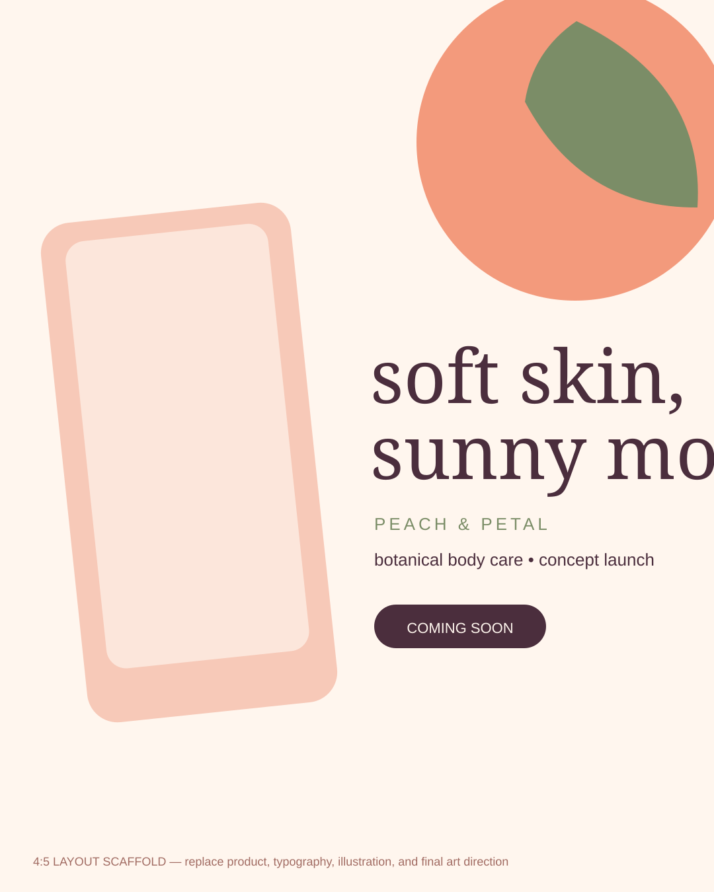

# 🍑 Peach & Petal

### **Consumer Brand Identity · Packaging · Print · Social · Motion**

**Independent Concept Project**

Peach & Petal is a fictional botanical body-care brand created to demonstrate a complete consumer identity system—from logo and packaging through launch campaign, retail touchpoints, and short-form motion.

> **Build status:** The vector files in this folder are concept scaffolds for dimensions, hierarchy, and system planning. Final artwork, packaging design, illustration, mockups, photography, and motion will be replaced with Brianna's manually created work.

---

## 🌷 The Brief

Create a body-care identity that feels **tactile, warm, botanical, and contemporary** without relying on generic minimal-luxury conventions. The brand should be expressive enough for social and gifting while structured enough to scale across multiple product lines.

### Audience

Design-conscious consumers roughly 22–40 who enjoy sensory self-care, small-batch beauty, thoughtful packaging, and products that feel giftable without feeling precious.

### Design challenge

The system needs to support:

- A memorable identity at small label sizes
- Multiple product variants without losing recognition
- Illustration/pattern as a meaningful brand asset
- Retail and e-commerce presentation
- Static and motion launch creative
- Premium feeling with approachable personality

---

## 🍑 Creative Direction

**Art-direction keywords:** sun-warmed · tactile · botanical · juicy · handmade · optimistic

The starter scaffold uses a peach/cream/sage/plum palette and rounded organic forms purely to establish contrast with the other case studies. The final visual language should come from original illustration, photography, material exploration, and typography.

### Final exploration goals

- Hand-drawn botanical or fruit illustration
- A custom wordmark or meaningfully modified type
- Paper/ink/material studies
- Pattern built from original artwork
- Product photography or manually art-directed mockups
- A flexible variant system for scent/product families

---

## 📦 Final Deliverables

### Identity
- [ ] Primary wordmark
- [ ] Secondary lockup
- [ ] Monogram/brand mark
- [ ] Color system
- [ ] Typography system
- [ ] Custom illustration/pattern library
- [ ] Icon set
- [ ] Mini brand guide

### Packaging + Print
- [ ] Body wash bottle label
- [ ] Body cream jar label
- [ ] Soap/carton packaging
- [ ] Shipping box or tissue system
- [ ] Product insert
- [ ] Retail shelf card/display
- [ ] Print-ready dieline example

### Marketing
- [ ] Launch key visual
- [ ] Instagram 4:5
- [ ] Instagram 1:1
- [ ] Story/Reel 9:16
- [ ] Email header
- [ ] Website/e-commerce banner
- [ ] Paid-social variation
- [ ] Gift-set promotional graphic

### Motion
- [ ] 3–5 second logo reveal
- [ ] 6–10 second animated product/social ad
- [ ] Simple type + illustration loop

---

## 🧠 Case Study Story

### 01 — Problem
Explain the crowded body-care market and the need for distinctive shelf/social recognition.

### 02 — Research + References
Show category audit, visual territories, materials, type exploration, illustration references, and what was intentionally avoided.

### 03 — Concept Development
Show at least three identity routes before the final direction. Include sketches and rejected explorations.

### 04 — Identity System
Present logo construction, typography, color, illustration/pattern, spacing, and variant logic.

### 05 — Packaging
Show the system across at least three SKUs. Include a flat-art/dieline view as well as mockups.

### 06 — Campaign
Demonstrate how packaging language expands into launch art, social, e-commerce, and retail.

### 07 — Motion
Show the logo or pattern becoming a short animation rather than treating motion as an unrelated add-on.

### 08 — Production + Reflection
Document what changed after testing small sizes, print constraints, accessibility, or mockup realism.

---

## 🛠 Tool Map

| Tool | Intended evidence |
|---|---|
| **Adobe Illustrator** | logo, vector illustration, pattern, packaging artwork |
| **Adobe Photoshop** | product retouching, image compositing, presentation mockups |
| **Adobe InDesign** | brand guide, product sell sheet, print collateral |
| **Adobe After Effects** | logo animation and social launch motion |
| **Figma** | digital campaign layouts and reusable format system |
| **Canva** | editable handoff-friendly social templates |

---

## 🎨 Starter Source Files

| File | Purpose |
|---|---|
| [logo-wordmark.svg](./source/logo-wordmark.svg) | wordmark proportion scaffold |
| [monogram.svg](./source/monogram.svg) | small brand-mark scaffold |
| [pattern.svg](./source/pattern.svg) | repeat/pattern exploration scaffold |
| [packaging-label-front.svg](./source/packaging-label-front.svg) | label hierarchy scaffold |
| [social-launch-1080x1350.svg](./source/social-launch-1080x1350.svg) | 4:5 launch layout scaffold |
| [logo-bloom.svg](./motion/logo-bloom.svg) | lightweight motion scaffold |

See [SOURCE-FILES.md](./source/SOURCE-FILES.md) and [MOTION-BRIEF.md](./motion/MOTION-BRIEF.md) before replacing them.

---

## ✅ What makes this case study portfolio-ready

The final project should feel like **one identity expressed through many applications**, not a collection of unrelated mockups. The strongest version will show original making—sketches, illustration, typography decisions, packaging production, and art direction—alongside polished outcomes.

[← Back to Graphic Design Portfolio](../README.md)
